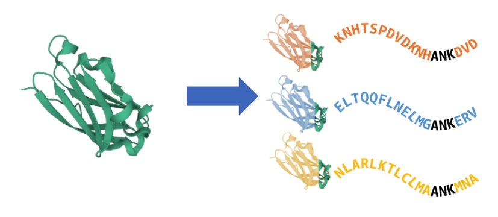
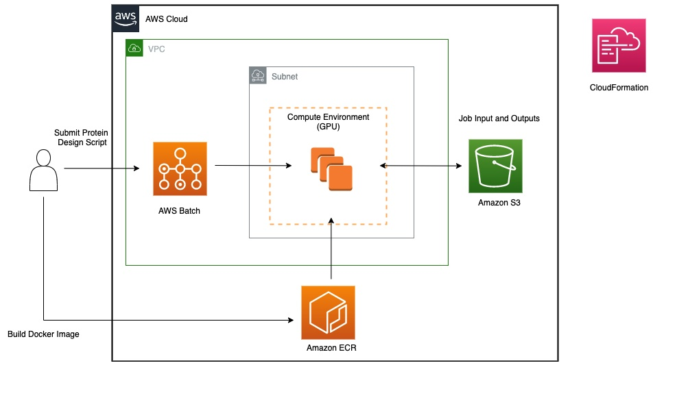

## Overview
Proteins are large biomolecules that play an important role in the body. A key problem in the field of macromolecule design is protein structure design. Frequently, this problem takes the form as follows **Given a protein structure and sequence, and a particular functional site, design a new protein that will fold into the same structure.** Generally, additional requirements are that certain components of the structure must have conserved properties, such as the preservation of an active site. 

This can be visulized with the following schematic:



In the schematic above, new structures are designed (orange, blue, yellow) that are structurally similair to the green structure, but have different sequences, while still preserving `ANK`. 
A number of tools and approaches leveraging deep learning such as [RFDesign](https://github.com/RosettaCommons/RFDesign) and [protein diffusion](https://arxiv.org/abs/2205.15019), have been developed to approach this problem and variants of it, 

In this repository, we demonstrate how RFDesign can be deployed on AWS infrastructure. The architecture for this approach is similair to the previously published [AWS Batch Architecture for Alphafold](https://github.com/aws-samples/aws-batch-architecture-for-alphafold). The architecture is as follows:


The respository contains the CloudFormation template, Dockerfile and sample scripts for submitting jobs to [AWS Batch](https://aws.amazon.com/batch/).


Note also that that this image only supports using the `hallucination` and `inpainting` functionality, and not the `AF_metrics` and `pyrosetta` functionality. If you wish to run that functionalilty, you will need to modify the image to download the Alphafold parameters. You can see the RFDesign released Docker [image](https://github.com/RosettaCommons/RFDesign/tree/main/docker) for how to do so.

We next outline the steps to deploy the workload. 

## 1. Build and Push the Docker Image to Amazon Elastic Container Registry


After cloning this respository and changing directory into into `AWS-Batch-Arch-for-RFDesign`, you must build and push the container to [Amazon Elastic Container Registry (ECR)](https://aws.amazon.com/ecr/). This image will clone the RFDesign respository and install the relevant dependencies. Note that for this step, you must have docker installed.

Optionally, you may also choose to locally run the tests provided by the RFDesign respository. If you wish to run these tests, you should comment out line `ENTRYPOINT ["bash", "-c"]`. You can then run the tests interactivley by running the docker image in interactive mode.
    
    IMAGE_NAME="proteindesign_image" #or select your own name
    
    sh ./build_and_push.sh Dockerfile $IMAGE_NAME
    
Copy the ECR URI for the image (it will look something lilike: xxxxxxxxxxxx.dkr.ecr.us-east-1.amazonaws.com/$IMAGE_NAME); you will need this for the Cloud Formation Template in the next step. Do not include the tag in the URI; the Cloud Formation Template deployed in the next step with automatically pull the latest version.
    
    
Please note that while it is possible to build and push the container from the your local machine (assuming that you have AWS CLI access), you may want to leverage an Amazon SageMaker Notebook with a GPU instance to build and push the container; building the image is generally faster on notebook instances. When testing, we were able to use an `ml.g4dn.xlarge` to build and push the image to ECR.


## 2. Deploy the CloudFormation Infrastructure Stack

Next, you must deploy the underlying infrastructure to support Batch job submissions. As shown in the diagram above, this includes a [Virtual Private Cloud](https://docs.aws.amazon.com/vpc/latest/userguide/what-is-amazon-vpc.html) (VPC) (which has a private and public subnet), and a Batch compute environment, which leverages the prive subnet for the compute environment.


### Option 1: Create New VPC Infrastructure

Use this option if you want to create all the infrastructure with new resources, including a new VPC and Batch environment.

To create all of the infrastructure needed, including the VPC, do as follows:
1. Choose **Launch Stack**:

    [](https://console.aws.amazon.com/cloudformation/home#/stacks/create/review?templateURL=https://aws-hcls-ml.s3.amazonaws.com/workshop/ProteinDesign/infrastructure/cfn_batch_rfdesign.yaml)
    
2. Provide a name for your stack, and fill in all the parameters:

* **ApplicationName** is the name of the application (default: ProtDesign)

* **StackAvailabilityZone**: the availability zone you wish to deploy in (default: us-east-1a)

* **ProtDesignContainerRegistryURI**: This is the URI of the protein design image you pushed to ECR in the previous step. If you did not record the URI, you can retrieve it from the ECR console.

3. Select **I acknowledge that AWS CloudFormation might create IAM resources with custom names**.
4. Choose **Create stack**.

### Option 2: Deploy with Existing VPC Infrastructure

If you already have a VPC and Subnet you wish to use, you can use this option. 

1. Choose **Launch Stack**:

    [](https://console.aws.amazon.com/cloudformation/home#/stacks/create/review?templateURL=https://aws-hcls-ml.s3.amazonaws.com/workshop/ProteinDesign/infrastructure/cfn_batch_rfdesign_existing_resources.yamll)
    
2. Provide a name for your stack, and fill in the parameters:

* **ApplicationName** is the name of the application (default: ProtDesign)

* **DefaultSecurityGroupID**: The existing Security group you wish to use.

* **Subnet**: The existing Subnet you wish to use.

* **ProtDesignContainerRegistryURI**: This is the URI of the protein design image you pushed to ECR in the previous step. If you did not record the URI, you can retrieve it from the ECR console.

3. Select **I acknowledge that AWS CloudFormation might create IAM resources with custom names**.
4. Choose **Create stack**.

Wait for the CFN to finish executing before running the next steps. This should take a few minutes.

## 3. Submit a Protein Hallucination Job

The `RFDesign` protein hallucination functionality allows for designing new proteins. The example here is slightly modified from the test script provided by rfdesign; and uses the structures `rsvf-v_5tpn.pdb` and `rsvf-v_5tpn_receptor_frag.pdb` provided by the RFDesign repository.

Prior to running this job, you must first put the files `rsvf-v_5tpn.pdb` and `rsvf-v_5tpn_receptor_frag.pdb` (found [here](https://github.com/RosettaCommons/RFDesign/tree/main/hallucination/tests)) in a bucket/directory in S3. S3_RF_DESIGN_LOCATION_INPUT must then be set to point to that location (e.g. "s3://my_bucket/5tpn_directory"). Set S3_RF_DESIGN_LOCATION_OUTPUT to a seperate output directory of your choosing in S3. 

If you wish to leverage this script for different structures, you will need to edit the corresponding structure names in the `rf_design_hallucination_batch_submission_template.json` file. 

First, change directory into the `AWS-Batch-Arch-for-RFDesign` directory. Then execute the following:


     STACK_NAME="" #use the name of the stack you used in cloud formation
     export S3_RF_DESIGN_LOCATION_INPUT="REPLACE_WITH_S3_LOCATION_INPUT" #e.g. s3://my_bucket/5tpn_directory"
     export S3_RF_DESIGN_LOCATION_OUTPUT="REPLACE_WITH_S3_LOCATION_OUTPUT"
     envsubst < rf_design_hallucination_batch_submission_template.json > example_rf_design_hallucination_batch_submission.json
     
     
     #get the job queue and job definition from the stack; you can also get this from the CloudFormation Console
     JOB_QUEUE=`aws cloudformation --region us-east-1 describe-stacks --stack-name ${STACK_NAME} --query "Stacks[0].Outputs[?OutputKey=='G4dnJobQueue'].OutputValue" --output text` 
     PROT_DESIGN_JOB_DEFINITION=`aws cloudformation --region us-east-1 describe-stacks --stack-name ${STACK_NAME} --query "Stacks[0].Outputs[?OutputKey=='ProtDesignJobDefinition'].OutputValue" --output text`
     
     aws batch submit-job --job-name protein_hallucination_job --job-queue  $JOB_QUEUE	--job-definition $PROT_DESIGN_JOB_DEFINITION    --container-overrides file://example_rf_design_hallucination_batch_submission.json
     
When submitting this job, it took about 5-10 minutes for the job to start. Once the job started, it took and about 30 seconds to finish. Note that you can decrease the latency for the job to start by increasing the `MinvCPU` parameter in the cloudformation template with a corresponding increase in cost for having continously running CPUs. You can modify the parameters of the job by modifying the file `rf_design_hallucination_batch_submission_template.json`.

## 4. Submit a Protein Inpainting Job

Protein inpainting can be used to for protein design when only some of the structure/sequence is provided. We use the example structure `2kl8.pdb` (found [here](https://github.com/RosettaCommons/RFDesign/tree/main/inpainting/tests)) from the RFDesign repository.
Note that for this job, S3_RF_DESIGN_LOCATION_INPUT must point to a file in S3 (e.g.  "s3://my_bucket/2kl8_directory/2kl8.pdb"), and not a directory.

If you wish to leverage this script for different structures, you will need to edit the corresponding structure names in the `rf_design_inpainting_batch_submission_template.json` file. 


    export S3_RF_DESIGN_LOCATION_INPUT="REPLACE_WITH_S3_LOCATION_INPUT"
    export S3_RF_DESIGN_LOCATION_OUTPUT="REPLACE_WITH_S3_LOCATION_OUTPUT"
    envsubst < rf_design_inpainting_batch_submission_template.json > example_rf_design_inpainting_batch_submission.json

    #get the job queue and job definition from the stack; you can also get this from the CloudFormation Console
    JOB_QUEUE=`aws cloudformation --region us-east-1 describe-stacks --stack-name ${STACK_NAME}--query "Stacks[0].Outputs[?OutputKey=='G4dnJobQueue'].OutputValue" --output text` 
    PROT_DESIGN_JOB_DEFINITION=`aws cloudformation --region us-east-1 describe-stacks --stack-name ${STACK_NAME} --query "Stacks[0].Outputs[?OutputKey=='ProtDesignJobDefinition'].OutputValue" --output text`

    aws batch submit-job --job-name protein_inpainting_job  --job-queue $JOB_QUEUE --job-definition $PROT_DESIGN_JOB_DEFINITION      --container-overrides file://example_rf_design_inpainting_batch_submission.json
    
When submitting this job, it took about 5-10 minutes for the job to start. Once the job started, it took and about 30 seconds to finish. Note that you can decrease the latency for the job to start by increasing the `MinvCPU` parameter in the cloudformation template with a corresponding increase in cost for having continously running CPUs.

    


## Citations
You can read more RFDesign preprint [here](https://www.biorxiv.org/content/10.1101/2021.11.10.468128v2.full.pdf) and the corresponding github repository [here](https://github.com/RosettaCommons/RFDesign).

The citation for RFDesign is:

```
@article {Wang2021.11.10.468128,
	author = {Wang, Jue and Lisanza, Sidney and Juergens, David and Tischer, Doug and Anishchenko, Ivan and Baek, Minkyung and Watson, Joseph L. and Chun, Jung Ho and Milles, Lukas F. and Dauparas, Justas and Exp{\`o}sit, Marc and Yang, Wei and Saragovi, Amijai and Ovchinnikov, Sergey and Baker, David},
	title = {Deep learning methods for designing proteins scaffolding functional sites},
	elocation-id = {2021.11.10.468128},
	year = {2021},
	doi = {10.1101/2021.11.10.468128},
	publisher = {Cold Spring Harbor Laboratory},
	URL = {https://www.biorxiv.org/content/early/2021/11/15/2021.11.10.468128},
	eprint = {https://www.biorxiv.org/content/early/2021/11/15/2021.11.10.468128.full.pdf},
	journal = {bioRxiv}
}


```

## Security

See [CONTRIBUTING](CONTRIBUTING.md#security-issue-notifications) for more information.

## License

This project is licensed under the Apache-2.0 License.


 
